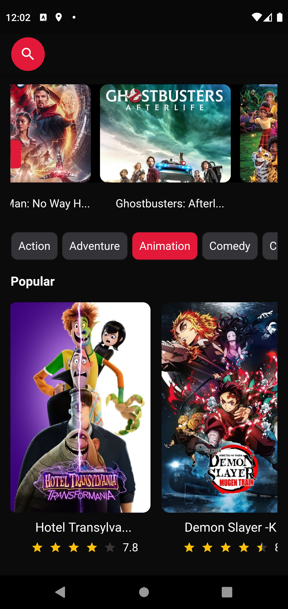
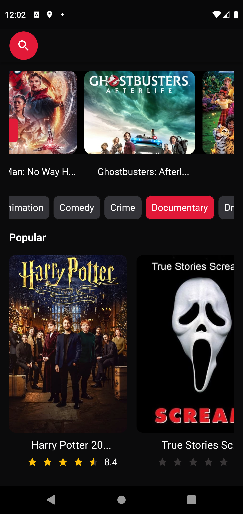
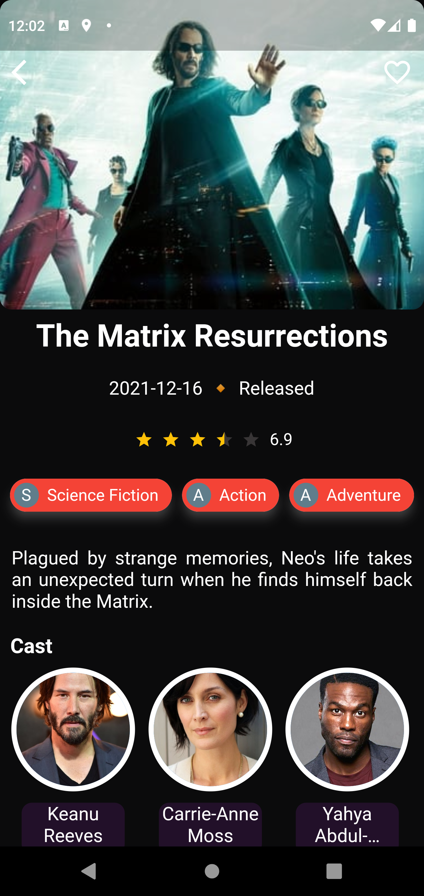
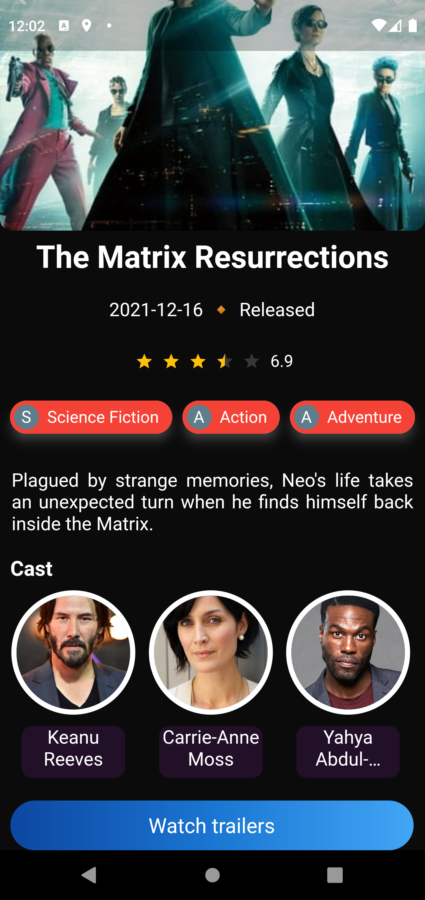
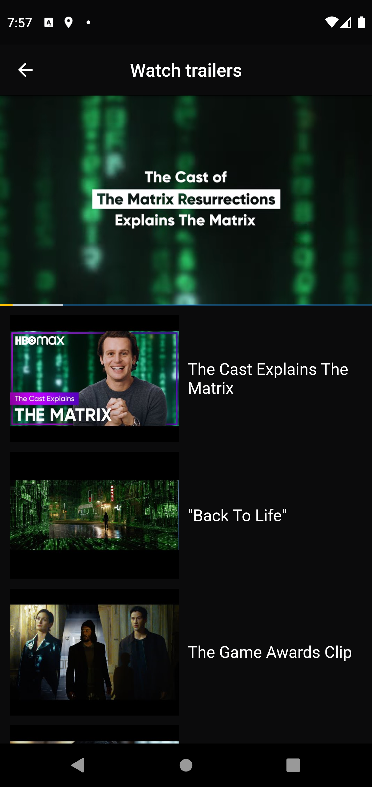
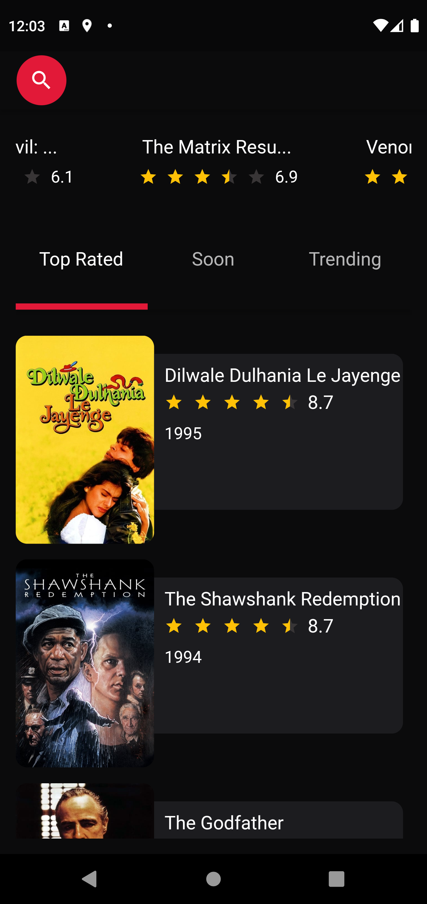
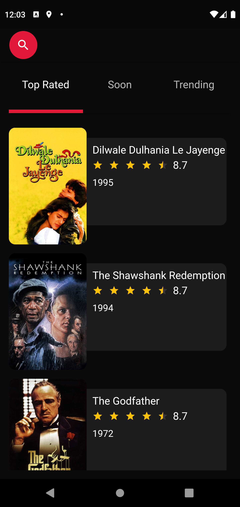
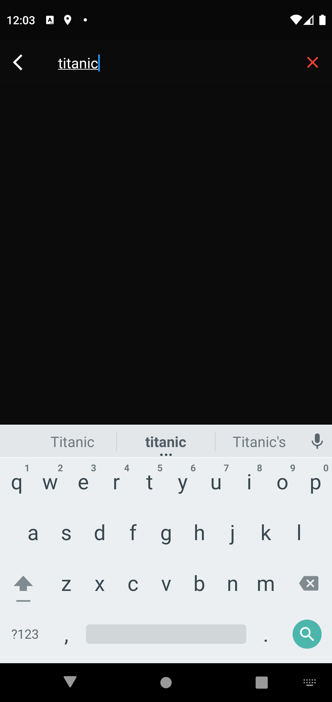
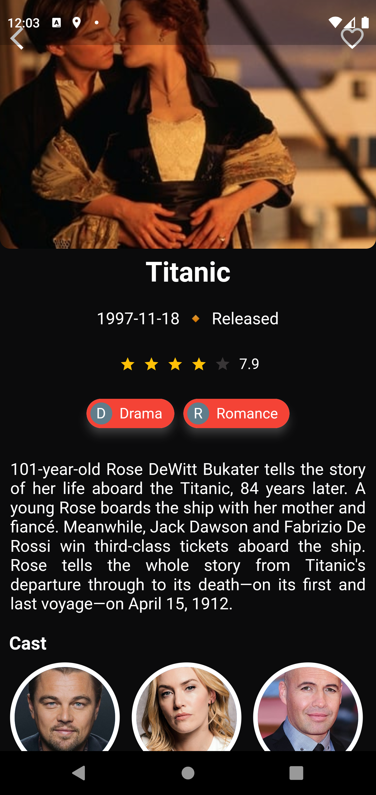

# Movies App with Clean Architecture, Unit Tests, Bloc Tests and Widget Tests

This project shows how to implement a movies app in Flutter.
I'm using Clean Architecture, Bloc 8.0.2 (latest version), Unit Tests, Bloc Tests and Widget Tests.
The app uses the TMDB API to fetch a list of movies, and includes features such as pagination and local or remote storage
(I'm still deciding wich storage option I will use).

  
  
  
  
  
  
  
  
  
  
  

  
# Running the project
  
This project uses the TMDB API to get the latest movies data.
Before running the app you need to sign up on the TMDB website, then obtain an API key on the settings API page.

# App Overview
  
The application is composed by five main sections: Now Playing, Popular, Top Rated, Soon and Trending.
Each movie shows as a poster using the image URL retrieved from the API. 
On Detail Movie Screen it's possible to see movie details such as: name, release date, rating, genres,
overview and cast. If a movie has a trailer available, the button "Watch Trailer" will appear and show 
a list of trailers.

# Supported State Management Solutions
  
- [Bloc 8.0.2 (latest version)](https://pub.dev/packages/bloc)
- [Cubit](https://pub.dev/packages/flutter_bloc)
  

